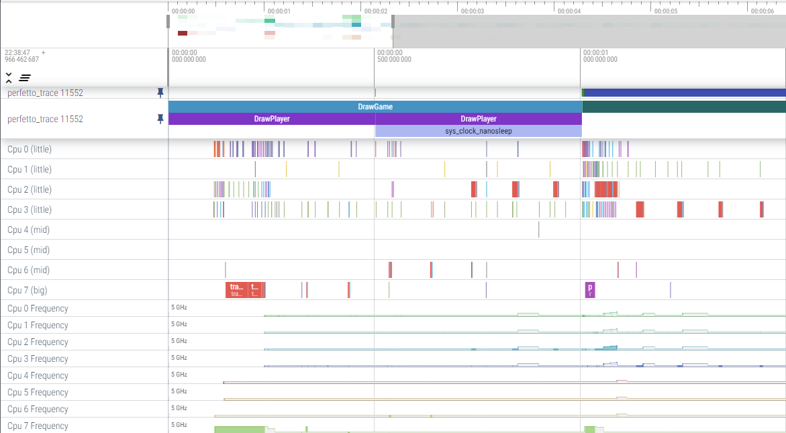

# ros2_tracing

Tracing tools with perfetto for ROS 2.

Device : RB5 ubuntu2.0
ROS version: ROS2 Foxy

## Building

As of Foxy, these instructions also apply to ubuntu or linux; it will not work out-of-the-box. Also, note that tracing using `ros2_tracing` is not supported on non-Linux systems.
We use perfetto instead of LTTng to trace ROS 2.

To enable tracing:

1. Install [perfetto](https://github.com/google/perfetto/releases) (`>=v37.0`) to control tracing and read traces:

    [perfetto for linux](./perfetto_tools/perfetto_for_linux.md)
2. Build ros2_tracing:
    ```
    mkdir -p /ros-ws/src
    cd /ros-ws/src/
    git clone ros2_tracing
    cd ../
    source /opt/ros/foxy/setup.bash
    export HOME=/data
    colcon build --cmake-args -DTRACETOOLS_DISABLED=OFF --allow-overriding tracetools
    ```
3. Source and check that tracing is enabled:
    ```
    source ./install/local_setup.bash or ./install/local_setup.sh
    ros2 run tracetools status
    ```

### Disabling tracing

Alternatively, to build and disable tracing, use `TRACETOOLS_DISABLED`:

```
colcon build --cmake-args " -DTRACETOOLS_DISABLED=ON"
```

## Tracing

The steps above will not lead to trace data being generated, and thus they will have no impact on execution. LTTng has to be configured for tracing. The packages in this repo provide two options.

### Trace command

The first option is to use the `perfetto` command.

```
$ cat /data/linux-arm64/trace_config.txt | perfetto --txt -c - -o /data/linux-arm64/perfetto-trace
```

By default, it will enable all ROS tracepoints and kernel tracepoints. The trace will be written to /data/linux-arm64/perfetto-trace. Run the command with `-h` for more information.

### Launch perfetto trace example

Another option is to use the `Trace` action in a launch file along with your `Node` action(s). This way, tracing happens when launching the launch file.

```
$ ros2 ros2 run tracetools perfetto_trace
```

See [this example perfetto_trace file](./tracetools/src/perfetto_trace.cpp) for more information.

## Design

See the [design document](./doc/design_ros_2.md).

## Packages

### tracetools

Library to support instrumenting ROS packages, including core packages.

This package claims to be in the **Quality Level 1** category, see the [Quality Declaration](./tracetools/QUALITY_DECLARATION.md) for more details.

See the [API documentation](https://ros-tracing.gitlab.io/ros2_tracing-api/).

## Analysis

See [`perfetto ui`](https://ui.perfetto.dev/).

