# `ros2_tracing`

Design document for the general ROS 2 instrumentation, tracing, and analysis effort, which includes [`ros2_tracing`](https://gitlab.com/ros-tracing/ros2_tracing), a collection of flexible tracing tools and multipurpose instrumentation for ROS 2.

**Table of contents**
- [`ros2_tracing`](#ros2_tracing)
  - [Introduction](#introduction)
  - [Instrumentation design](#instrumentation-design)
    - [General guidelines](#general-guidelines)
    - [Flow description](#flow-description)
      - [Process creation](#process-creation)
      - [Node/component creation](#nodecomponent-creation)
      - [Publisher creation](#publisher-creation)
      - [Subscription creation](#subscription-creation)
      - [Executors](#executors)
      - [Subscription callbacks](#subscription-callbacks)
      - [Message publishing](#message-publishing)
      - [Service creation](#service-creation)
      - [Service callbacks](#service-callbacks)
      - [Client creation](#client-creation)
      - [Client request/response](#client-requestresponse)
      - [Timer creation](#timer-creation)
      - [Timer callbacks](#timer-callbacks)
      - [State machine creation](#state-machine-creation)
      - [State machine transitions](#state-machine-transitions)
  - [Design \& implementation notes](#design--implementation-notes)
    - [Targeted tools/dependencies](#targeted-toolsdependencies)
    - [Design](#design)
  - [Architecture](#architecture)
    - [Notes on client libraries](#notes-on-client-libraries)
  - [Analysis](#analysis)

## Introduction

Perfetto bundles a number of data sources that are able to gather detailed performance data from different system interfaces.
Now we use this trace tool to profil ROS2 event from rclcpp,rcl and rmw.

## Instrumentation design

This section includes information about ROS 2's design & architecture through descriptions of the main execution flows.
The instrumentation can then be built around that.

The following table summarizes the instrumentation and links to the corresponding subsections.

| Layer    | Instrumentation Point                | Ref |
|   :--:   | :--                                  | :-- |
| `rclcpp` | `rclcpp_subscription_init`           | [*Subscription creation*](#subscription-creation) |
|          | `rclcpp_subscription_callback_added` | [*Subscription creation*](#subscription-creation) |
|          | `rclcpp_publish`                     | [*Message publishing*](#message-publishing) |
|          | `rclcpp_take`                        | [*Subscription callbacks*](#subscription-callbacks) |
|          | `rclcpp_service_callback_added`      | [*Service creation*](#service-creation) |
|          | `rclcpp_timer_callback_added`        | [*Timer creation*](#timer-creation) |
|          | `rclcpp_timer_link_node`             | [*Timer creation*](#timer-creation) |
|          | `rclcpp_callback_register`           | [*Subscription creation*](#subscription-creation), [*Service creation*](#service-creation), [*Timer creation*](#timer-creation) |
|          | `callback_start`                     | [*Subscription callbacks*](#subscription-callbacks), [*Service callbacks*](#service-callbacks), [*Client request/response*](#client-requestresponse), [*Timer callbacks*](#timer-callbacks) |
|          | `callback_end`                       | [*Subscription callbacks*](#subscription-callbacks), [*Service callbacks*](#service-callbacks), [*Client request/response*](#client-requestresponse), [*Timer callbacks*](#timer-callbacks) |
|          | `rclcpp_executor_get_next_ready`     | [*Executors*](#executors) |
|          | `rclcpp_executor_wait_for_work`      | [*Executors*](#executors) |
|          | `rclcpp_executor_execute`            | [*Executors*](#executors), [*Timer callbacks*](#timer-callbacks), [*Subscription callbacks*](#subscription-callbacks) |
| `rcl`    | `rcl_init`                           | [*Process creation*](#process-creation) |
|          | `rcl_node_init`                      | [*Node/component creation*](#nodecomponent-creation) |
|          | `rcl_publisher_init`                 | [*Publisher creation*](#publisher-creation) |
|          | `rcl_subscription_init`              | [*Subscription creation*](#subscription-creation) |
|          | `rcl_publish`                        | [*Message publishing*](#message-publishing) |
|          | `rcl_take`                           | [*Subscription callbacks*](#subscription-callbacks) |
|          | `rcl_client_init`                    | [*Client creation*](#client-creation) |
|          | `rcl_service_init`                   | [*Service creation*](#service-creation) |
|          | `rcl_timer_init`                     | [*Timer creation*](#timer-creation) |
|          | `rcl_lifecycle_state_machine_init`   | [*State machine creation*](#state-machine-creation) |
|          | `rcl_lifecycle_transition`           | [*State machine transitions*](#state-machine-transitions) |
| `rmw`    | `rmw_publisher_init`                 | [*Publisher creation*](#publisher-creation) |
|          | `rmw_subscription_init`              | [*Subscription creation*](#subscription-creation) |
|          | `rmw_publish`                        | [*Message publishing*](#message-publishing) |
|          | `rmw_take`                           | [*Subscription callbacks*](#subscription-callbacks) |

### General guidelines

Instrumentation points can be split into two types: initialization events and runtime events.
The former collect one-time information about the state of objects, e.g., creation of publishers, subscriptions, and services.
The latter collect information about events throughout the runtime, e.g., message publication and callback execution.
The former are therefore predominantly triggered on system initialization and are used to minimize the payload size of the latter to minimize overhead in the runtime phase.
The information that is collected to form the trace data can then be used to build a model of the execution.
Due to the very abstractional nature of the ROS 2 architecture, multiple instrumentation points are sometimes needed to gather the necessary information.
Both the instrumentation point name and the payload can be meaningful: some instrumentation points only differ by their names and are used to indicate the originating layer.

### Flow description

This subsection contains descriptions of the main execution flows using text and sequence diagrams.
These diagrams include the instrumentation points as calls to `tracetools`.
Instrumentation point calls with a question mark (`TP?()`) are not currently implemented.

Each execution flow also has a list of important information that should be collected.
These lists roughly correspond to and fulfill the [instrumentation requirements](#requirements-instrumentation) and follows the [guidelines](#general-guidelines).
All of this therefore serves as support for instrumentation design decisions.

#### Process creation

In the call to `rclcpp::init()`, a process-specific `rclcpp::Context` object is fetched and CLI arguments are parsed.
Much of the work is actually done by `rcl` through a call to `rcl_init()`.
This call processes the `rcl_context_t` handle, which is wrapped by the `Context` object.
Also, inside this call, `rcl` calls `rmw_init()` to process the `rmw` context (`rmw_context_t`) as well.
This `rmw` handle is itself part of the `rcl_context_t` handle.

This has to be done once per process, and usually at the very beginning.
The components that are then instanciated share this context.

**Important information**:
* `tracetools` version

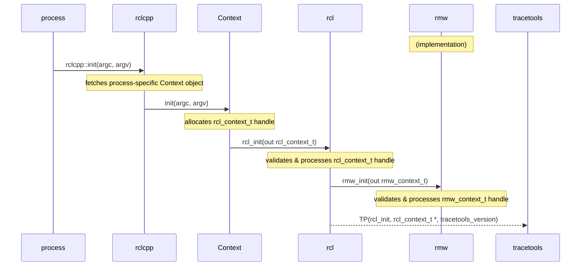

#### Node/component creation

In ROS 2, a process can contain multiple nodes.
These are sometimes referred to as "components."

These components are instanciated by the containing process.
They are usually classes that extend `rclcpp::Node`, so that the node initialization work is done by the parent constructor.

This parent constructor will allocate its own `rcl_node_t` handle and call `rcl_node_init()`, which will validate the node name/namespace.
`rcl` will also call `rmw_create_node()` to get the node's `rmw` handle (`rmw_node_t`).
This will be used later by publishers and subscriptions.

**Important information**:
* Link between `rcl_node_t` and `rmw_node_t` handles
* Link between node handle(s)
* Node name and node namespace

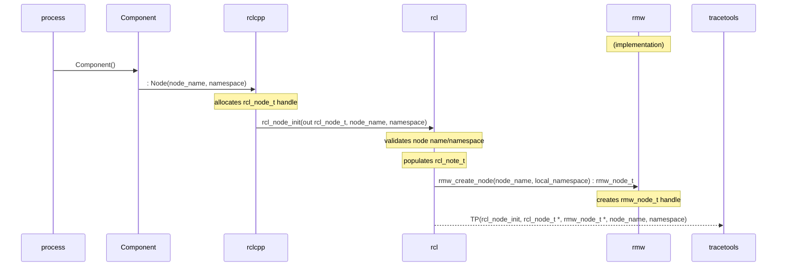

#### Publisher creation

The node calls `rclcpp::create_publisher()`.
That ends up creating an `rclcpp::Publisher` object which extends `rclcpp::PublisherBase`.
The latter allocates an `rcl_publisher_t` handle, fetches the corresponding `rcl_node_t` handle, and calls `rcl_publisher_init()` in its constructor.
`rcl` does topic name expansion/remapping/validation.
It creates an `rmw_publisher_t` handle by calling `rmw_create_publisher()` of the given `rmw` implementation and associates it with the node's `rmw_node_t` handle and the publisher's `rcl_publisher_t` handle.
`rmw` associates the `rmw_publisher_t` handle with the underlying DDS object's GID.

<!-- Note: there is an optional intra-process setup step, but it might not be relevant on the publisher side. -->

**Important information**:
* Link between `rcl_publisher_t` and `rmw_publisher_t` handles
* Link to underlying DDS object's GID
* Link to corresponding node handle
* Topic name
* *Some* QoS information

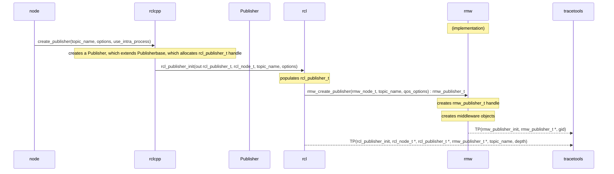

#### Subscription creation

Subscription creation is done in a very similar manner.

The node calls `rclcpp::create_publisher()`, which ends up creating an `rclcpp::Subscription` object which extends `rclcpp::SubscriptionBase`.
The latter allocates an `rcl_subscription_t` handle, fetches its `rcl_node_t` handle, and calls `rcl_subscription_init()` in its constructor.
`rcl` does topic name expansion/remapping/validation.
It creates an `rmw_subscription_t` handle by calling `rmw_create_subscription()` of the given `rmw` implementation and associates it with the node's `rmw_node_t` handle and the subscription's `rcl_subscription_t` handle.
`rmw` associates the `rmw_subscription_t` handle with the underlying DDS object's GID.
`rclcpp::Subscription` creates an `rclcpp::AnySubscriptionCallback` object and associates it with itself.

If intra-process is enabled, `rclcpp::Subscription` also creates a `rclcpp::SubscriptionIntraProcess` object, which has its own `rclcpp::AnySubscriptionCallback` object.

**Important information**:
* Link between `rcl_subscription_t` and `rmw_subscription_t` handles and `rclcpp::Subscription` object
* Link between `rcl_subscription_t` and `rclcpp::SubscriptionIntraProcess` object
* Link to callback object(s), with callback function symbol string
* Link to underlying DDS object's GID
* Link to corresponding node handle
* Topic name
* *Some* QoS information

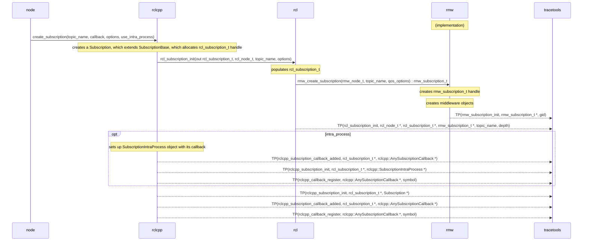

#### Executors

An `rclcpp::Executor` object is created for a given process.
It can be a `rclcpp::executors::SingleThreadedExecutor` or a `rclcpp::executors::MultiThreadedExecutor`, with the former currently being the default.

Nodes are instanciated, usually as a `shared_ptr` through `std::make_shared<Node>()`, then added to the executor with `rclcpp::Executor::add_node()`.

After all the nodes have been added, `rclcpp::Executor::spin()` is called (there are other spinning varations, but this is the main one).
`rclcpp::executors::SingleThreadedExecutor::spin()` simply loops forever until the process' context isn't valid anymore.
It fetches the next `rclcpp::AnyExecutable` (e.g., subscription, timer, service, client), possibly waiting a bit, and calls `rclcpp::Executor::execute_any_executable()` with it.
This then calls the relevant `execute*()` method (e.g., [`execute_timer()`](#timer-callbacks), [`execute_subscription()`](#subscription-callbacks), `execute_service()`, `execute_client()`).

**Important information**:
* Timestamps of executor phases
* Link to handle of object being executed (e.g., timer, subscription)

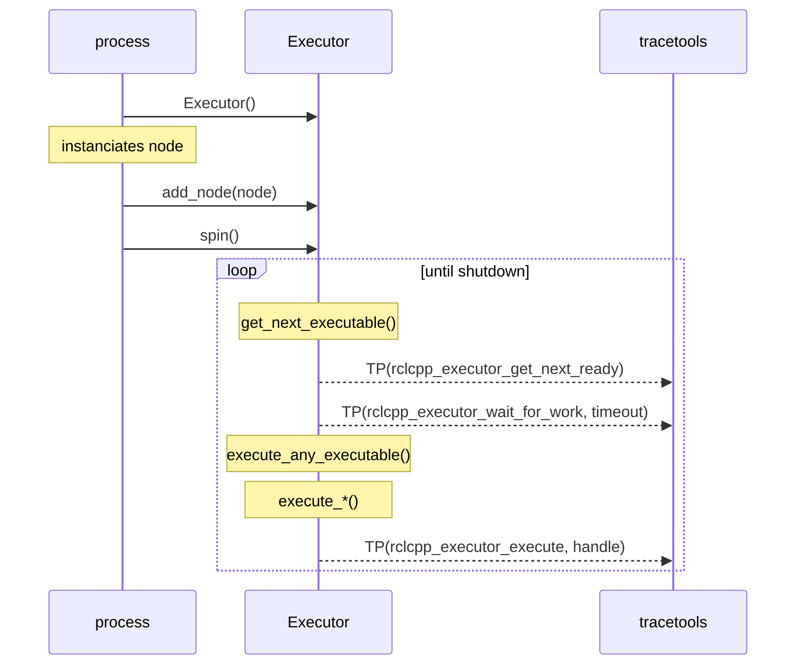

#### Subscription callbacks

Subscriptions are handled in the `rclcpp` layer.
Callback functions are wrapped by an `rclcpp::AnySubscriptionCallback` object, which is [registered when creating the `rclcpp::Subscription` object](#subscription-creation).

In [`rclcpp::Executor::execute_subscription()`, the `rclcpp::Executor`](#executors) asks the `rclcpp::Subscription` to allocate a message though `rclcpp::SubscriptionBase::create_message()` (there are other ways to get/allocate messages, like loaning, but this is the main one).
It then calls `rcl_take*()`, which calls `rmw_take_with_info()`, which gets the message from the underlying middleware.
If that is successful, the `rclcpp::Executor` then passes that on to the subscription through `rclcpp::SubscriptionBase::handle_message()`.
This checks if it's the right type of subscription (i.e., inter vs. intra process), and then it calls `rclcpp::AnySubscriptionCallback::dispatch()` on its callback object with the message (cast to the actual type).
This calls the actual `std::function` with the right signature.

Finally, it returns the message object through `rclcpp::SubscriptionBase::return_message()`.
For simple messages without loaning, it simply gets deallocated.

**Important information**:
* Link to handle(s) of subscription being executed
* Message being taken
* Source timestamp of message being taken
* Link to callback object being dispatched, with start/end timestamps
* Whether the callback dispatching is for intra-process or not

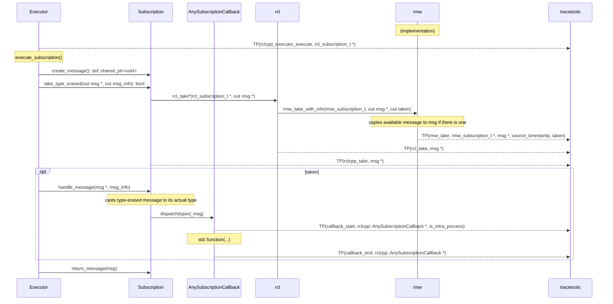

#### Message publishing

To publish a message, a message object is first allocated (or loaned) and then populated at the user level (e.g., in a node).
The message is then published through one of the `rclcpp::Publisher::publish()` methods.
For normal inter-process publishing, this then passes that on to `rcl`, which itself passes it to `rmw`, which passes it on to the underlying middleware.

TODO add inter- vs. intra-process execution flow
TODO talk about IntraProcessManager stuff?

**Important information**:
* Link to publisher handle(s)
* Message being published, with timestamp
* TODO
    * Source timestamp of message being published

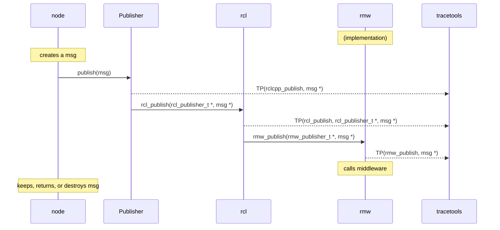

#### Service creation

Service server creation is similar to subscription creation.
The node calls `rclcpp::create_service()` which ends up creating a `rclcpp::Service`.
In its constructor, it allocates a `rcl_service_t` handle, and then calls `rcl_service_init()`.
This processes the handle and validates the service name.
It calls `rmw_create_service()` to get the corresponding `rmw_service_t` handle.
`rclcpp::Service` creates an `rclcpp::AnySubscriptionCallback` object and associates it with itself.

**Important information**:
* Link between `rcl_service_t` and `rmw_service_t` handles
* Link to callback object, with callback function symbol string
* Link to corresponding node handle
* Service name

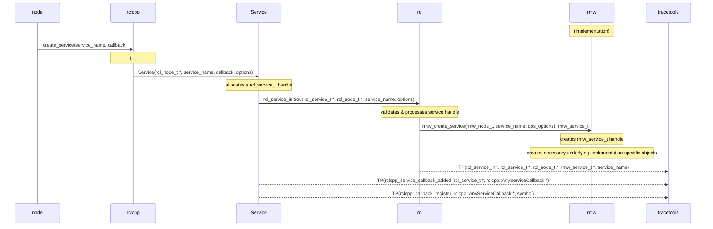

#### Service callbacks

Service callbacks are similar to subscription callbacks.
In `rclcpp::Executor::execute_service()`, the `rclcpp::Executor` allocates request header and request objects.
It then calls `rclcpp::Service::take_type_erased_request()`, which calls `rcl_take_request()` & `rmw_take_request()`.

If those are successful and a new request is taken, then the `rclcpp::Executor` calls `rclcpp::Service::handle_request()` with the request.
This casts the request to its actual type, allocates a response object, and calls `rclcpp::AnyServiceCallback::dispatch()`, which calls the actual `std::function` with the right signature.

If there is a service response for the request, `rclcpp::Service::send_response()` is called, which calls `rcl_send_response()` & `rmw_send_response()`.

**Important information**:
* Request being taken
* Link to callback object being dispatched, with start/end timestamps
* TODO
    * Link to handle(s) of service being executed
    * Source timestamp of request being taken
    * Link between request and response

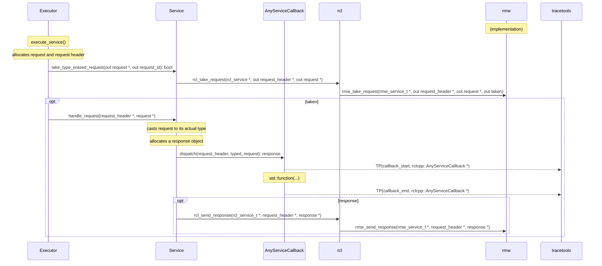

#### Client creation

Client creation is similar to publisher creation.
The node calls `rclcpp::create_client()` which ends up creating a `rclcpp::Client`.
In its constructor, it allocates a `rcl_client_t` handle, and then calls `rcl_client_init()`.
This validates and processes the handle.
It also calls `rmw_create_client()` which creates the `rmw_client_t` handle.

**Important information**:
* Link between `rcl_client_t` and `rmw_client_t` handles
* Link to corresponding node handle
* Service name

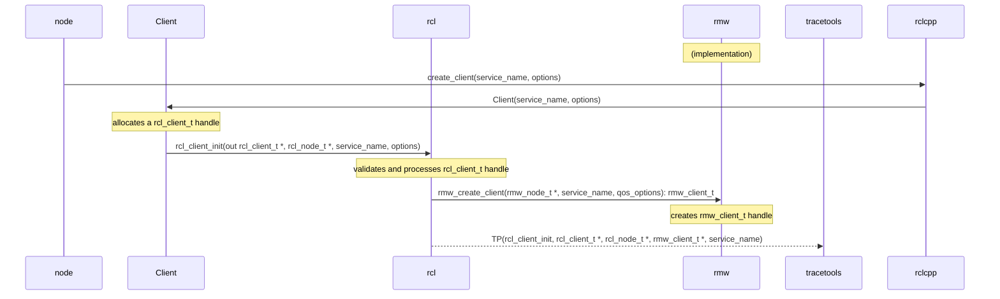

#### Client request/response

A client request has multiple steps.
The node (or the owner of the `rclcpp::Client`, at the user level) first creates a request object and populates it.
It then calls `rclcpp::Client::async_send_request()` with the request.
It can also provide a callback, but it's optional.
The `rclcpp::Client` passes that on to `rcl` by calling `rcl_send_request()`.
`rcl` generates a sequence number and assigns it to the request, then calls `rmw_send_request()`.
Once this is done, the `rclcpp::Client` puts this sequence number in an internal map along with the created promise and future objects, and the callback (which might simply be empty).

If a callback was provided when sending the request, the `rclcpp::Client` simply uses the executor to spin and lets its callback be called.
Otherwise, it uses the future object returned by `rclcpp::Client::async_send_request()`, and calls `rclcpp::spin_until_future_complete()`.
This waits until the future object is ready, or until timeout, and returns.
If this last call was successful, then the node can get the result (i.e., response) and do something with it.

**Important information**:
* TODO
    * Link to handle(s) of client
    * Request being sent, with timestamp
    * Link to callback object being used, with start/end timestamps
    * Response being taken
    * Source timestamp of response being taken
    * Link to response

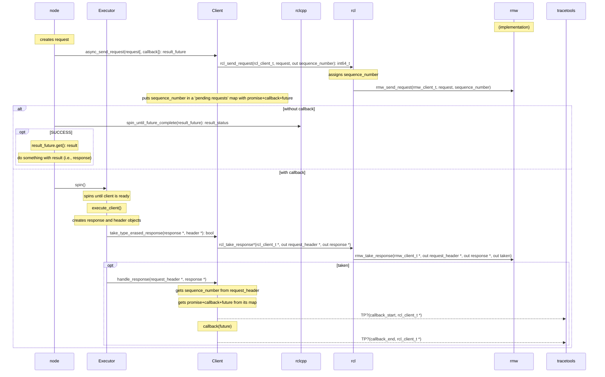

#### Timer creation

Timer creation is similar to subscription creation.
The node calls `rclcpp::create_wall_timer()` which ends up creating a `rclcpp::WallTimer`, which extends `rclcpp::GenericTimer`, which extends `rclcpp::TimerBase`.
In its constructor, it creates a `rclcpp::Clock` object, which (for a `rclcpp::WallTimer`) is simply a nanosecond clock.
It then allocates a `rcl_timer_t` handle, and then calls `rcl_timer_init()`.
This processes the handle and validates the period.
`rclcpp::GenericTimer` has its own callback.
Also, timers are not linked to any node at the `rcl` level.
They are only linked to nodes at the `rclcpp` level in `rclcpp::create_wall_timer()`, after being created.

Note that `rcl_timer_init()` can take a callback as a parameter, but right now that feature is not used anywhere (`nullptr` is given), and callbacks are instead handled in the `rclcpp` layer.

**Important information**:
* Timer handle
* Timer period
* Link to corresponding node handle
* Link to timer callback, with symbol

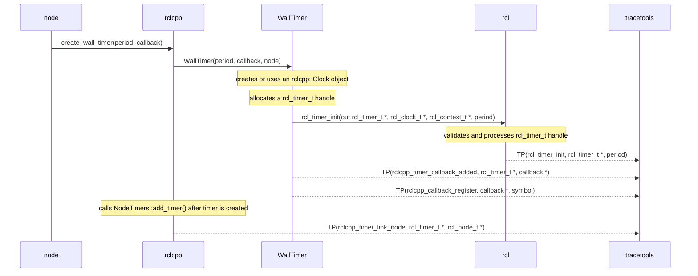

#### Timer callbacks

Timer callbacks are similar to susbcription callbacks.
The executor spins until the timer is ready.
Then the `rclcpp::Executor` calls `rclcpp::Executor::execute_timer()`, which calls `rclcpp::WallTimer::execute_callback()`.
This calls the actual callback `std::function`.
Depending on the `std::function` that was given when creating the timer, it will either call the callback without any parameters or it will pass a reference of itself.

**Important information**:
* Link to handle of timer being executed
* Link to timer callback object being executed, with start/end timestamps

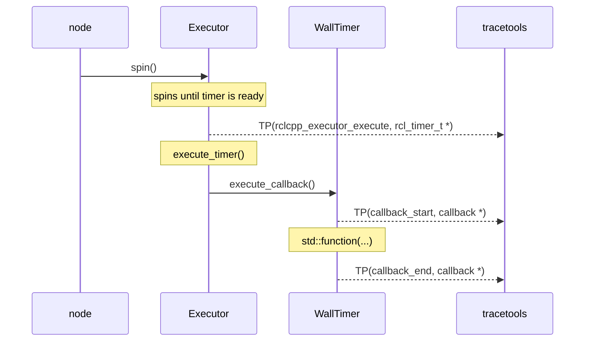

#### State machine creation

State machines are usually created when an `rclcpp::LifecycleNode` is initialized.
It calls `rcl_lifecycle_state_machine_init()`.

**Important information**:
* Link between state machine handle and node handle

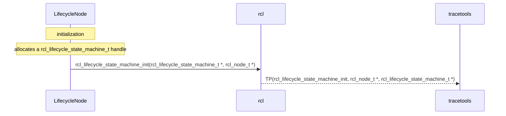

#### State machine transitions

State machine transitions are usually triggered by `rclcpp::LifecycleNode::trigger_transition()`, which are themselves triggered by `rclcpp::LifecycleNode`'s various standard state transition methods.

**Important information**:
* Link to handle of state machine being state-transitioned
* Start and goal labels (i.e., current state and next state, respectively)

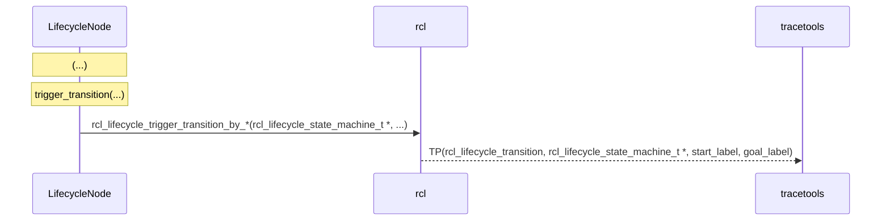

## Design & implementation notes

### Targeted tools/dependencies

The targeted tools or dependencies are:

* perfetto for tracing
* perfetto UI for analysis & visualization

### Design

Perfetto is a production-grade open-source stack for performance instrumentation and trace analysis. It offers services and libraries for recording system-level and app-level traces, native + java heap profiling, a library for analyzing traces using SQL and a web-based UI to visualize and explore multi-GB traces.
We use perfetto instead of LTTng to trace ROS 2. The suggested setup is:

* a tracing package (e.g. `tracetools`) wraps calls to perfetto SDK
* ROS 2 is instrumented with calls to the tracing package, therefore it becomes a dependency and ships with the core stack
* by default, the tracing package's functions are empty -- they do not do anything
* if users wants to enable tracing, they need to
    * Setup perfetto enviorment
    * compile the tracing package from source, setting the right compile flag(s)
    * overlay it on top of their ROS 2 installation
* use perfetto UI for analysis and visualization

## Architecture

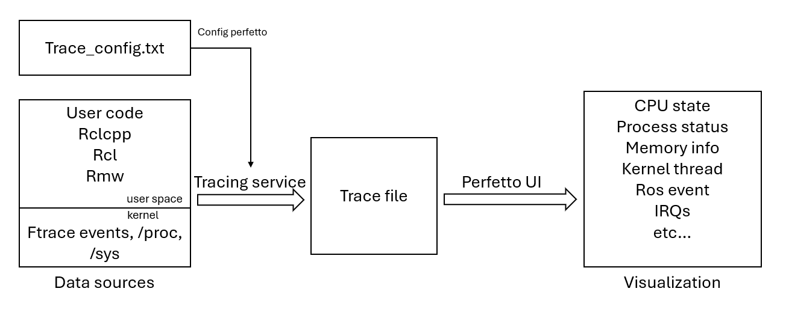

### Notes on client libraries

ROS offer a client library (`rcl`) written in C as the base for any language-specific implementation, such as `rclcpp` and `rclpy`.

However, `rcl` is obviously fairly basic, and still does leave a fair amount of implementation work up to the client libraries. For example, callbacks are not handled in `rcl`, and are left to the client library implementations.

This means that some instrumentation work will have to be re-done for every client library that we want to trace. We cannot simply instrument `rcl`, nor can we only instrument the base `rmw` interface if we want to dig into that.

This effort should first focus on `rcl` and `rclcpp` , but `rclpy` should eventually be added and supported.

## Analysis
We can now explore the captured trace visually by using a dedicated web-based UI.

https://ui.perfetto.dev
